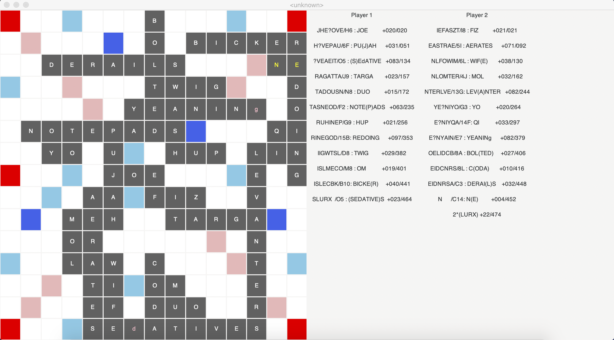
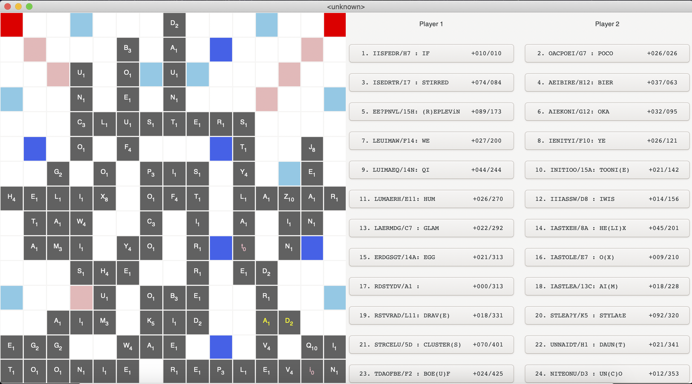
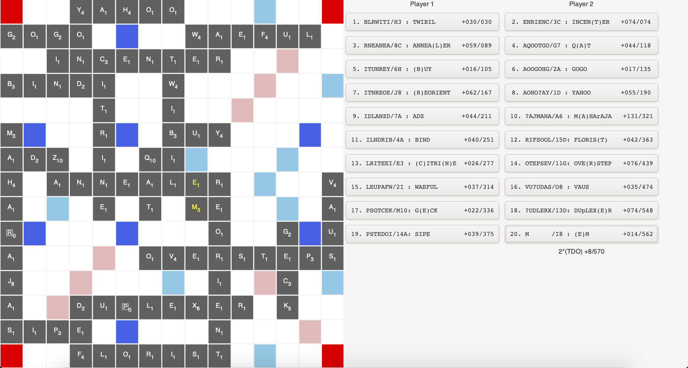
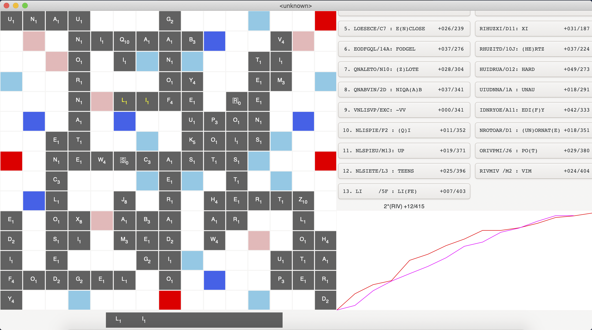

# gaddag-rust
aye matey, a rusty gaddag https://ericsink.com/downloads/faster-scrabble-gordon.pdf

## Building and running

``` bash
$ cargo run --release (text|viz)
```

Default argument is viz. Both will run a single AI game.


### To get total time

```
sum(map(int, [i.split()[-1] for i in s.split("\n") if 'Time' in i]))
```

## Current UI Status

Initial UI



Scores, Clickable moves



Boxed Blanks, shrunk moves



Rack, graph



UI Roadmap

- clickable moves :white_check_mark:
  - make look like labels/less big
- only highlight newly placed tiles
- customizable blanks, colors, everything
- shows considered moves
- placable moves
- more features

# Human Play

## Termion Roadmap

- [x] box moves
  - [x] number moves
  - [x] softcode 27
- [x] box bag
- [x] box rack
- [x] set tiles from rack
- [ ] game
  - [x] valid move: connected checker
  - [x] when typing: skip placed tiles
  - [x] score tracker
  - [x] blinking move hypothetical: red invalid, green valid
    - [x] add scores

### Bugs

- [x] backspace
- [x] enforce rack
- [x] Pre-word
- [x] single letter move
- [ ] fix bag
- [ ] can't click outside board
- [ ] handle blanks: shift type
- [ ] player-based: can't tell what opponents rack is
- [ ] press enter before clicking: glitch

### enhancements

- [ ] blinking cursor
- [ ] todo: z score is 10
- [ ] player choices